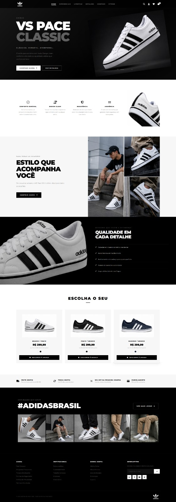

# 👟 Landing Page Adidas VS Pace 2.0

Uma Landing Page promocional premium, moderna e totalmente responsiva desenvolvida para o tênis **Adidas VS Pace 2.0**.

O projeto foi construído utilizando uma arquitetura Full Stack moderna com:

- Frontend em Vue 3 + TypeScript + Vite
- Backend em Node.js + Express + Nodemailer
- Newsletter integrada via API REST
- Estrutura componentizada
- Otimização de performance
- Responsividade avançada
- Boas práticas de acessibilidade (a11y)

---

# 🚀 Demonstração

Visualização rápida do projeto finalizado:



---

# ✨ Funcionalidades Principais

## 🎨 Interface Premium

- Layout moderno inspirado em grandes marcas esportivas
- Design minimalista com foco visual no produto
- Hero section cinematográfica
- Sessões fluidas e altamente responsivas

---

## 👟 Vitrine Interativa de Produtos

Sistema reativo de troca de variantes do tênis:

- Branco/Preto
- Preto/Branco
- Marinho

Com:

- Hover interativo
- Alteração dinâmica de imagens
- Feedback visual fluido
- Transições suaves

---

## 📸 Mosaico Social Dinâmico

Feed visual estilo Instagram com:

- Grid responsivo
- Overlay animado
- Lazy loading
- Renderização condicional com `v-if`

---

## 📩 Newsletter Full Stack

Integração completa entre Frontend e Backend:

### Frontend
- Formulário reativo em Vue
- Validação instantânea
- Estados de loading
- Feedback visual dinâmico

### Backend
- API REST em Express
- Integração SMTP com Nodemailer
- Envio automático de e-mails
- Rate Limit
- Tratamento global de erros
- CORS configurado

---

## ⚡ Performance

- Lazy Loading nativo
- Imports otimizados via Vite
- Componentização
- CSS escopado
- Imagens otimizadas
- Estrutura preparada para produção

---

## ♿ Acessibilidade (a11y)

- HTML5 semântico
- `aria-label`
- `role="list"`
- `role="listitem"`
- Navegação acessível
- Estrutura preparada para leitores de tela

---

# 🛠️ Tecnologias Utilizadas

## Frontend

- [Vue 3](https://vuejs.org/)
- [TypeScript](https://www.typescriptlang.org/)
- [Vite](https://vitejs.dev/)
- [FontAwesome](https://fontawesome.com/)
- CSS3 Scoped

---

## Backend

- [Node.js](https://nodejs.org/)
- [Express](https://expressjs.com/)
- [Nodemailer](https://nodemailer.com/)
- [Cors](https://www.npmjs.com/package/cors)
- [Dotenv](https://www.npmjs.com/package/dotenv)
- [Express Rate Limit](https://www.npmjs.com/package/express-rate-limit)

---

# 📂 Estrutura do Projeto

```bash
projeto-fullstack/
│
├── frontend/
│   ├── public/
│   ├── src/
│   │   ├── assets/
│   │   ├── components/
│   │   ├── App.vue
│   │   └── main.ts
│   │
│   ├── .env
│   ├── vite.config.ts
│   └── package.json
│
├── backend/
│   ├── src/
│   │   ├── config/
│   │   ├── controllers/
│   │   ├── middlewares/
│   │   ├── routes/
│   │   └── server.js
│   │
│   ├── .env
│   └── package.json